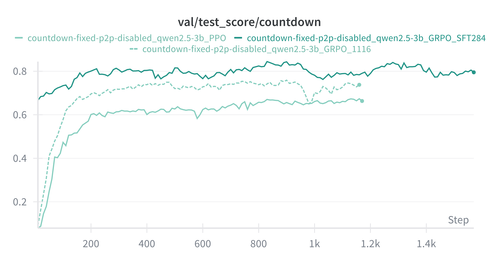
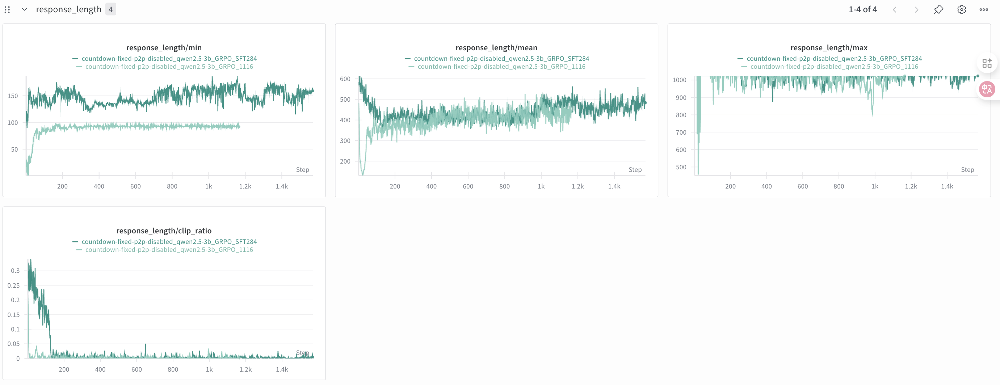
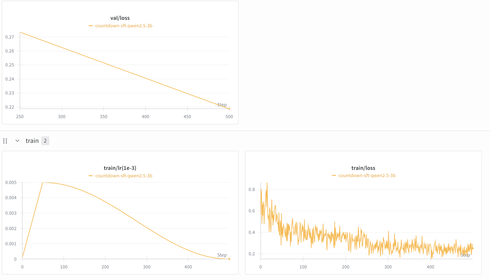

# TinyZero


TinyZero is a reproduction of [DeepSeek R1 Zero](https://github.com/deepseek-ai/DeepSeek-R1) in countdown and multiplication tasks. We built upon [veRL](https://github.com/volcengine/verl).

Through RL, the 3B base LM develops self-verification and search abilities all on its own 

You can experience the Ahah moment yourself for < $30 

Twitter thread: https://x.com/jiayi_pirate/status/1882839370505621655

Full experiment log: https://wandb.ai/jiayipan/TinyZero

> 📢: We release [Apative Parallel Reasoning](https://github.com/Parallel-Reasoning/APR), where we explore a new dimension in scaling reasoining models

## Experiments [@Jillian]
[full wandb details](https://wandb.ai/jillianwangzhihui-unc-charlotte/TinyZero/workspace) : https://wandb.ai/jillianwangzhihui-unc-charlotte/TinyZero/workspace




## Installation

```
conda create -n zero python=3.9
# install torch [or you can skip this step and let vllm to install the correct version for you]
pip install torch==2.4.0 --index-url https://download.pytorch.org/whl/cu121
# install vllm
pip3 install vllm==0.6.3 # or you can install 0.5.4, 0.4.2 and 0.3.1
pip3 install ray

# verl
pip install -e .

# flash attention 2
pip3 install flash-attn --no-build-isolation
# quality of life
pip install wandb IPython matplotlib
```
💡 Tips by Jillian: 
* For detailed environment configuration, please refer to pip_list.txt.
* ⚠️ Please commend ’source ./fix_environment.sh‘ in shell files, it depends on different env.

## Countdown task

**Data Preparation**
```
conda activate zero
python ./examples/data_preprocess/countdown.py --local_dir {path_to_your_dataset}
```

### Run Training
```
conda activate zero
```

For the following code, if you see Out-of-vram, try add `critic.model.enable_gradient_checkpointing=True` to the script, and checkout the discussion [here](https://github.com/Jiayi-Pan/TinyZero/issues/5#issuecomment-2624161643)

**Single GPU**


Works for model <= 1.5B. For Qwen2.5-0.5B base, we know it fails to learn reasoning.

```
export N_GPUS=1
export BASE_MODEL={path_to_your_model}
export DATA_DIR={path_to_your_dataset}
export ROLLOUT_TP_SIZE=1
export EXPERIMENT_NAME=countdown-qwen2.5-0.5b
export VLLM_ATTENTION_BACKEND=XFORMERS

bash ./scripts/train_tiny_zero.sh
```

**3B+ model**
In this case, the base model is able to develop sophisticated reasoning skills.
```
export N_GPUS=2
export BASE_MODEL={path_to_your_model}
export DATA_DIR={path_to_your_dataset}
export ROLLOUT_TP_SIZE=2
export EXPERIMENT_NAME=countdown-qwen2.5-3b
export VLLM_ATTENTION_BACKEND=XFORMERS

bash scripts/train_tiny_zero.sh
```

**train GRPO [@Jillian]** 
```
bash train_3b_grpo.sh 
```
**train PPO [@Jillian]**
```
bash train_3b_ppo.sh 
```

### Run Generation [@Jillian]
```
conda activate zero

bash scripts/inference_ppo.sh
```

### Run Evaluation [@Jillian]
```
conda activate zero

bash scripts/eval_ppo.sh ${data_path} ${output_dir}
```


## 💡SFT of Qwen2.5-3B [@Jillian]
**Data Preparation**

I use [HuggingFaceTB/Countdown-Task-GOLD](https://huggingface.co/datasets/HuggingFaceTB/Countdown-Task-GOLD) for SFT, and
* Fine-tuning Data: The 3B model was primarily fine-tuned on a dataset synthesized by the verified_Qwen2.5-7B-Instructand, verified_Qwen3-4B-Instruct-2507models.
* Arithmetic Data Balancing: To improve performance on multiplication and division, the ratio of arithmetic operations in the training data was set to 4 (+, -) : 3 (*) : 3 (/).
* Dataset Scale: The training and testing sets contain 18,000 and 1,024 samples, respectively.
* Train model: Qwen2.5-3B

```
conda activate zero
python python ./examples/data_preprocess/countdown_sft.py --local_dir {path_to_your_dataset}
```

**Training**
```
conda activate zero

bash train_sft_qwen2.5_3b.sh 4
```



**Generate**
```
conda activate zero

bash scripts/inference_sft.sh ${model_path}
```

**Evaluation**
```
conda activate zero

bash scripts/eval_sft.sh ${data_path} ${output_dir}
```


## Acknowledge
* We run our experiments based on [veRL](https://github.com/volcengine/verl).
* We use Qwen2.5 series base model [Qwen2.5](https://github.com/QwenLM/Qwen2.5).

## Citation
```
@misc{tinyzero,
author       = {Jiayi Pan and Junjie Zhang and Xingyao Wang and Lifan Yuan and Hao Peng and Alane Suhr},
title        = {TinyZero},
howpublished = {https://github.com/Jiayi-Pan/TinyZero},
note         = {Accessed: 2025-01-24},
year         = {2025}
}
```
